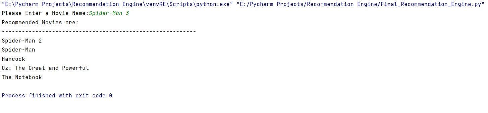

# *Movie Recommendation Engine built during workshop by codeheroku*

*Recommendation Engine:*
1. Match the following
2. Matching between customers and products
3. It recommends customers based on behavior of other customers who are similar to current customer
4. Ex. Netflix, Amazon

*Quiz:*
1. Who are the Users and Items for RE in the following platforms?
     a. Linkedin
     b. Amazon
     c. Netflix
     d. Facebook

 Linkedin --> Users: Members, Items: Members
 Amazon --> Users: Members, Items: Products
 Netflix --> Users: Members, Items: Movies, Web series
 Facebook --> Users: Members, Items: Members (like: People you may know)

*Types of Recommendation systems:*
1. Content Based Recommendation
2. Collaborative filtering Recommendation

**The Recommendation Built is Content Based Recommendation**

**Output:**

